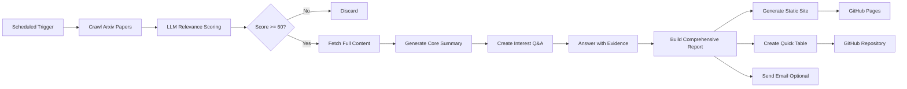

# 📚 CI-LLM4APR — Arxiv Paper Auto-Pusher Powered by LLM

**CI-LLM4APR** is an intelligent tool that automatically crawls, filters, summarizes, and tracks papers from Arxiv based on your research interests.

The project regularly fetches the latest papers from Arxiv related to your research topics, uses LLM to generate detailed summaries and analysis, builds browsable reports via **GitHub Pages**, AND maintains a quick-reference paper tracking table in a GitHub repository.

**Key Features**:
- ✅ Automatic paper crawling from Arxiv
- ✅ LLM-powered relevance scoring and intelligent filtering
- ✅ **Detailed 5-aspect paper analysis** (Problem, Solution, Methodology, Experiments, Conclusion)
- ✅ **Interest-based Q&A generation** tailored to your research focus
- ✅ **Comprehensive paper summaries** with confidence scores
- ✅ **Static website generation** via GitHub Pages for in-depth reading
- ✅ **Quick-reference table** automatically committed to GitHub (Title, Date, Venue)
- ✅ Email digest support (optional)
- ✅ Supports Chinese and English output

**Dual Output Mode**:
1. **Detailed Reports** → GitHub Pages (comprehensive analysis)
2. **Quick Table** → GitHub Repository (fast paper tracking)

**Cost**: Approximately $0.1 per paper for complete analysis.

>[中文版本](README_zh.md)
---

## 🚀 Quick Start (about 5 min)

### 1. Fork the Repository

Fork this project to your personal GitHub account.

### 2. Configure pipeline.yaml

Edit the `config/pipeline.yaml` file. The minimal core configuration is as follows:

```yaml
openai:
  api_key: "${API_KEY}"
  base_url: "https://<github_username>.github.io/CI-LLM4APR"
  relevance_model: "gpt-4o-mini"
  language: "zh-CN"  # or "en"

topics:
  - name: "your_topic"
    label: "Your Research Topic"
    query:
      categories: ["cs.SE", "cs.AI"]
      include: ["keyword1", "keyword2"]
      exclude: ["quantum", "biomedical"]
    interest_prompt: |
      Describe your research interests here...

github:
  enabled: true
  token: "${GH_TOKEN}"  # Do NOT use GITHUB_* prefix (reserved by GitHub Actions)
  repo_name: "your_username/your_repo"
  branch: "updates"
  file_path: "update.md"
```

> 💡 Tip: You can configure multiple topics, and the project will crawl and track papers for each research direction.

------

### 3. Configure Secrets

Go to your repository:

**Settings → Secrets and Variables → Actions → New repository secret**

Add the following secrets:

| Secret Name     | Description                  | Required | How to Get |
|-----------------|------------------------------|----------|------------|
| API_KEY         | OpenAI/LLM API key           | ✅       | [OpenAI API Keys](https://platform.openai.com/api-keys) |
| BASE_URL        | LLM API endpoint (optional)  | ⚠️       | Leave empty for OpenAI, or use compatible endpoint |
| GH_TOKEN        | GitHub Personal Access Token | ✅       | [Create token](https://github.com/settings/tokens) with `repo` scope. **Note:** Do NOT use `GITHUB_*` prefix (reserved by GitHub Actions) |

> 🔑 **GitHub Token**: Generate a Personal Access Token with `repo` permissions to allow the workflow to commit to your repository.

------

### 4. Install Dependencies (Local Run)

If you want to run locally first:

```bash
# Install Python dependencies
pip install -r requirements.txt

# Run the pipeline
python -m src.main
```

------

### 5. Enable GitHub Actions

The project includes GitHub Actions workflows for automatic execution:

- Go to **Actions** tab in your repository
- Enable workflows if prompted
- Manually trigger the workflow for testing, or wait for scheduled execution

You can customize the schedule in `.github/workflows/weekly-pipeline.yml`.

------

### 6. Check Results

After running, the pipeline will:
1. Fetch papers from Arxiv matching your topics
2. Filter papers using LLM-based relevance scoring
3. Extract publication venue information (conference/journal)
4. Commit results to the specified branch and file in your target repository

Check the `updates` branch (or your configured branch) in your target repository to see the generated `update.md` file with the paper table.

---

## 💼 How It Works

The project follows these steps:

1. **Crawl Papers**: Fetch new papers from Arxiv based on user-configured topics (categories, keywords, date range)
2. **Filter Papers**: Use LLM to score papers across multiple relevance dimensions (topic alignment, methodology fit, novelty, etc.)
3. **Deep Analysis**: For papers passing the threshold (default: 60/100):
   - Fetch full paper content from ar5iv or PDF
   - Generate 5-aspect core summary (Problem, Solution, Methodology, Experiments, Conclusion)
   - Create interest-based questions aligned with your research focus
   - Answer questions with direct quotes and evidence from the paper
   - Build comprehensive overview with confidence scores
4. **Generate Outputs**:
   - **Static Website**: Build detailed HTML reports via GitHub Pages
   - **Quick Table**: Create/update markdown table in GitHub repository
   - **Email Digest**: Send summary to specified recipients (optional)

### 📊 Dual Output Examples

#### 1️⃣ Quick Reference Table (`update.md` in GitHub)

```markdown
# Paper Updates

*Last updated: 2025-10-13 10:30 UTC*

| Title | Published Date | Venue/Conference |
| --- | --- | --- |
| [Awesome Paper Title](https://arxiv.org/abs/2401.12345) | 2024-01-15 | ICSE 2024 |
| [Another Great Paper](https://arxiv.org/abs/2402.67890) | 2024-02-20 | arXiv |
| [Third Paper Name](https://arxiv.org/abs/2403.11111) | 2024-03-10 | NeurIPS 2023 |
```

#### 2️⃣ Detailed Report (GitHub Pages)

Each paper gets a comprehensive analysis page with:
- Brief narrative summary (Why? What? How?)
- 5-aspect core analysis
- Interest-based Q&A
- Detailed findings with confidence scores
- Comprehensive overview
- Recommendation explanation

### ⚙️ System Flowchart



### 🎯 Venue Extraction

The system uses both rule-based patterns and LLM to extract publication venue:

- **Rule-based**: Recognizes common conference/journal patterns (ICSE, FSE, TSE, etc.)
- **LLM-powered**: For complex cases, uses LLM to interpret paper comments and extract venue names
- **Fallback**: Defaults to "arXiv" if no venue is mentioned

Example comment parsing:
- "Accepted to ICSE 2024" → **ICSE 2024**
- "Published in IEEE Transactions on Software Engineering" → **IEEE Transactions on Software Engineering**
- No comment → **arXiv**

---

## 🤝 Contributing

Contributions are welcome! Submit Issues or Pull Requests.

1. Fork this repository
2. Create a feature branch: git checkout -b feature/AmazingFeature
3. Commit your changes: git commit -m 'Add some AmazingFeature'
4. Push the branch: git push origin feature/AmazingFeature
5. Open a Pull Request 🎉

------

## 📄 License

This project is licensed under the **MIT License**

See [LICENSE](LICENSE) for details.

------

## 🙏 Acknowledgements

- [Arxiv](https://arxiv.org/) — Paper data source
- [GitHub Actions](https://github.com/features/actions) — Automation platform
- [OpenAI](https://openai.com) — Powerful LLM support

---


