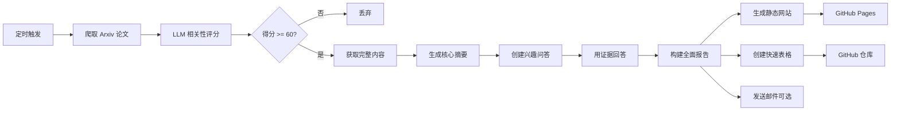
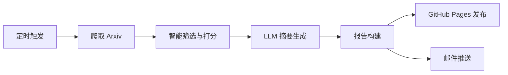

# **📚 CI-LLM4APR — 基于 LLM 的 Arxiv 论文自动推送器**

**CI-LLM4APR** 是一个基于用户研究兴趣自动爬取、筛选、总结并追踪论文的智能化工具。

项目会定期从 Arxiv 获取与你研究方向相关的最新论文,利用 LLM 生成详细的摘要和分析,通过 **GitHub Pages** 构建可浏览的深度报告,**同时**在 GitHub 仓库中维护一个快速参考的论文追踪表格。

**核心功能**:
- ✅ 自动从 Arxiv 爬取论文
- ✅ 基于 LLM 的相关性评分和智能筛选
- ✅ **五维度论文深度分析** (问题、方案、方法、实验、结论)
- ✅ **基于研究兴趣的问答生成** 针对性强
- ✅ **全面的论文摘要** 附带置信度评分
- ✅ **静态网站生成** 通过 GitHub Pages 深度阅读
- ✅ **快速参考表格** 自动提交到 GitHub (标题、日期、期刊)
- ✅ 邮件推送支持(可选)
- ✅ 支持中英文输出

**双重输出模式**:
1. **详细报告** → GitHub Pages (全面分析)
2. **快速表格** → GitHub 仓库 (快速追踪)

**成本**: 完整分析约每篇论文 0.1 美元。

> [English Version](README.md)

示例 Demo：[查看这里](https://yeren66.github.io/CI-LLM4APR)

## **💼 工作原理**

项目执行以下流程：

1. **爬取论文**: 根据用户配置的主题从 Arxiv 获取新论文(分类、关键词、日期范围)
2. **筛选论文**: 使用 LLM 对论文进行多维度相关性评分(主题匹配度、方法契合度、新颖性等)
3. **深度分析**: 对达到阈值(默认: 60/100)的论文:
   - 从 ar5iv 或 PDF 获取完整论文内容
   - 生成五维度核心摘要(问题、方案、方法、实验、结论)
   - 创建与你研究兴趣相关的问题
   - 用论文中的直接引证回答问题
   - 构建带置信度评分的全面概述
4. **生成输出**:
   - **静态网站**: 通过 GitHub Pages 构建详细的 HTML 报告
   - **快速表格**: 在 GitHub 仓库创建/更新 Markdown 表格
   - **邮件推送**: 发送摘要给指定收件人(可选)

### **📊 双重输出示例**

#### 1️⃣ 快速参考表格 (GitHub 中的 `update.md`)

```markdown
# Paper Updates

*Last updated: 2025-10-13 10:30 UTC*

| Title | Published Date | Venue/Conference |
| --- | --- | --- |
| [很棒的论文标题](https://arxiv.org/abs/2401.12345) | 2024-01-15 | ICSE 2024 |
| [另一篇很棒的论文](https://arxiv.org/abs/2402.67890) | 2024-02-20 | arXiv |
| [第三篇论文名称](https://arxiv.org/abs/2403.11111) | 2024-03-10 | NeurIPS 2023 |
```

#### 2️⃣ 详细报告 (GitHub Pages)

每篇论文都有一个全面的分析页面,包含:
- 简要叙述摘要(为什么？是什么？怎么做？)
- 五维度核心分析
- 基于兴趣的问答
- 带置信度评分的详细发现
- 综合概述
- 推荐理由说明

### **⚙️ 系统流程图**



### **🎯 期刊/会议提取**

系统结合规则和 LLM 来提取发表期刊/会议：

- **基于规则**: 识别常见会议/期刊模式(ICSE、FSE、TSE 等)
- **LLM 驱动**: 对于复杂情况,使用 LLM 解释论文评论并提取期刊/会议名称
- **兜底策略**: 如果未提及期刊/会议则默认为 "arXiv"

评论解析示例：
- "Accepted to ICSE 2024" → **ICSE 2024**
- "Published in IEEE Transactions on Software Engineering" → **IEEE Transactions on Software Engineering**
- 无评论 → **arXiv**LLM 进行智能筛选和元数据提取,自动将论文信息以结构化的 Markdown 表格形式提交到 GitHub 仓库。

**核心特性**:
- ✅ 自动从 Arxiv 爬取论文
- ✅ 基于 LLM 的相关性评分和筛选
- ✅ 自动从论文元数据中提取发表期刊/会议信息
- ✅ 结构化表格格式(标题、发表日期、期刊/会议)
- ✅ 自动提交到 GitHub 仓库(独立分支)
- ✅ 支持中英文输出

**成本**: LLM 使用量极低(仅用于筛选和元数据提取),每篇论文约 $0.01-0.02。

> [English Version](README.md)vPaper — 基于 LLM 的 Arxiv 论文自动推送器**


---

## **🚀 快速开始（约 5 分钟）**

### **1. Fork 仓库**

将本项目 **Fork** 到你的个人 GitHub 账户下。

### **2. 配置 pipeline.yaml**

修改 `config/pipeline.yaml` 文件,最小核心配置如下：

```yaml
openai:
  api_key: "${API_KEY}"
  base_url: "${BASE_URL}"
  relevance_model: "gpt-4o-mini"
  language: "zh-CN"  # 或 "en"

topics:
  - name: "your_topic"
    label: "你的研究主题"
    query:
      categories: ["cs.SE", "cs.AI"]
      include: ["关键词1", "关键词2"]
      exclude: ["quantum", "biomedical"]
    interest_prompt: |
      在此描述你的研究兴趣...

github:
  enabled: true
  token: "${GITHUB_TOKEN}"
  repo_name: "username/repository"  # 目标仓库(用于保存论文追踪表格)
  branch: "updates"  # 要提交到的分支(如不存在会自动创建)
  file_path: "update.md"  # 用于存储论文表格的文件
```

> 💡 提示：可以配置多个 topic,项目会分别爬取和追踪每个研究方向的论文。

------

### **3. 配置 Secrets**

在仓库中打开：

**Settings → Secrets and Variables → Actions → New repository secret**

添加以下密钥：

| **密钥名称**    | **说明**                     | **是否必需** | **如何获取**                                                 |
| --------------- | ---------------------------- | ------------ | ------------------------------------------------------------ |
| API_KEY         | OpenAI/LLM API 密钥          | ✅            | [OpenAI API Keys](https://platform.openai.com/api-keys)     |
| BASE_URL        | LLM API 端点(可选)           | ⚠️            | OpenAI 留空,或使用兼容端点                                   |
| GITHUB_TOKEN    | GitHub 个人访问令牌          | ✅            | [创建 Token](https://github.com/settings/tokens) 需要 `repo` 权限 |

> 🔑 **GitHub Token**: 生成具有 `repo` 权限的个人访问令牌,以允许工作流提交到你的仓库。

------

### **4. 安装依赖(本地运行)**

如果想先在本地运行：

```bash
# 安装 Python 依赖
pip install -r requirements.txt

# 运行流水线
python -m src.main
```

------

### **5. 启用 GitHub Actions**

项目包含用于自动执行的 GitHub Actions 工作流：

- 前往仓库的 **Actions** 标签页
- 如有提示则启用工作流
- 手动触发工作流进行测试,或等待定时执行

你可以在 `.github/workflows/weekly-pipeline.yml` 中自定义执行计划。

------

### **6. 查看结果**

运行后,流水线将：
1. 从 Arxiv 获取与你的主题匹配的论文
2. 使用基于 LLM 的相关性评分筛选论文
3. 提取发表期刊/会议信息
4. 将结果提交到目标仓库的指定分支和文件

检查目标仓库中的 `updates` 分支(或你配置的分支),查看生成的 `update.md` 文件及其中的论文表格。

---

## **💼 工作原理**

项目每周自动执行一次以下流程：

1. 根据用户配置的研究主题，从 Arxiv 爬取最近一周的新论文；
2. 对论文进行智能筛选（基于标题、作者、摘要等信息），从新颖性、完整性等方面评分；
3. 筛除低于 60 分的论文；
4. 调用 LLM 对选定论文进行五维度总结；
5. 生成可阅读的报告页面，并自动推送至 GitHub Pages；
6. （可选）将报告以邮件形式发送给指定收件人。

### **📄 LLM 总结模板示例**

```
请从以下 5 个方面帮我总结这篇论文：
1. 主要解决了什么问题？
2. 提出了什么解决方案？
3. 核心方法/策略是什么？（详细说明）
4. 实验设计如何？Metrics、baseline 和 dataset 是什么？
5. 论文的结论是什么？
```

LLM 在总结后还会根据用户的研究兴趣自动生成若干“延伸问题”并尝试回答，以提供更贴合研究方向的洞见。

### **⚙️ 系统流程图**



---

## **🤝 参与贡献**

欢迎提交 Issue 或 Pull Request！

1. Fork 本仓库
2. 创建特性分支：git checkout -b feature/AmazingFeature
3. 提交更改：git commit -m 'Add some AmazingFeature'
4. 推送分支：git push origin feature/AmazingFeature
5. 发起 Pull Request 🎉

------

## **📄 License**

本项目采用 **MIT 协议**

详情请参见 [LICENSE](LICENSE)。

------

## **🙏 致谢**

- [Arxiv](https://arxiv.org/) — 论文数据来源
- [GitHub Actions](https://github.com/features/actions) — 自动化执行平台
- [OpenAI](https://openai.com) — 提供 强大的LLM 支持（虽然API得自己花钱）

